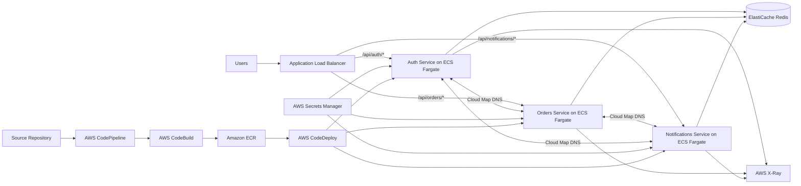

# Containerized Microservices with ECS Fargate and Service Discovery

This project demonstrates how to migrate a monolithic Node.js application into three independently deployable microservices running on **Amazon ECS with AWS Fargate**:

- **Auth Service**
- **Orders Service**
- **Notifications Service**

The architecture uses an Application Load Balancer for public traffic, AWS Cloud Map for private service discovery, Amazon ElastiCache for shared session caching, AWS Secrets Manager for runtime secrets, and CodePipeline with CodeDeploy for blue/green deployments.

## Architecture Diagram

The complete architecture diagram is available here:

- [Open the architecture diagram as PDF](./ecs-fargate-microservices-architecture.pdf)

## Architecture Overview



## AWS Services

| Service | Responsibility |
|---|---|
| Amazon ECS | Runs and manages the Auth, Orders, and Notifications services. |
| AWS Fargate | Provides serverless container compute without managing EC2 instances. |
| Amazon ECR | Stores private Docker images and scans images for vulnerabilities on push. |
| Application Load Balancer | Terminates HTTPS and routes requests to services using URL paths. |
| AWS Cloud Map | Registers ECS tasks and provides DNS-based service discovery. |
| AWS Secrets Manager | Stores database credentials, API keys, and Redis authentication secrets. |
| Amazon ElastiCache for Redis | Provides a shared session and cache layer for stateless containers. |
| AWS CodePipeline | Orchestrates source, build, image publishing, and deployment stages. |
| AWS CodeBuild | Builds and tests Docker images before pushing them to ECR. |
| AWS CodeDeploy | Performs ECS blue/green deployments and automatic rollback. |
| AWS X-Ray | Traces requests across services and generates a distributed service map. |
| Amazon CloudWatch | Centralizes container logs, metrics, alarms, and deployment diagnostics. |

## Request Flow

1. A client sends an HTTPS request to the Application Load Balancer.
2. The ALB listener evaluates path-based routing rules.
3. Requests are forwarded to the correct ECS target group:
   - `/api/auth/*` to the Auth service
   - `/api/orders/*` to the Orders service
   - `/api/notifications/*` to the Notifications service
4. The selected ECS task processes the request.
5. Internal calls use Cloud Map DNS names instead of public endpoints.
6. Session data and frequently accessed values are stored in Redis.
7. Trace data is sent to AWS X-Ray, while logs and metrics are sent to CloudWatch.

## Service Discovery

Each ECS service is registered in a private AWS Cloud Map namespace such as:

```text
microservices.local
```

Example internal service names:

```text
auth.microservices.local
orders.microservices.local
notifications.microservices.local
```

A service can call another service using its private DNS name:

```text
http://orders.microservices.local:3000/internal/orders
```

Security groups should allow service-to-service traffic only on the required application ports.

## Application Load Balancer Routing

A single HTTPS listener can route traffic to separate target groups.

| Priority | Path pattern | Target group |
|---:|---|---|
| 10 | `/api/auth/*` | `auth-blue-tg` or `auth-green-tg` |
| 20 | `/api/orders/*` | `orders-blue-tg` or `orders-green-tg` |
| 30 | `/api/notifications/*` | `notifications-blue-tg` or `notifications-green-tg` |

Each service should expose a dedicated health endpoint:

```text
GET /health
```

The health endpoint should verify that the process is running without performing expensive dependency checks on every ALB probe.

## Blue/Green Deployment

Each ECS service uses two task sets:

- **Blue task set:** currently receives production traffic.
- **Green task set:** receives the newly deployed container version.

Deployment flow:

1. CodePipeline detects a source change.
2. CodeBuild runs tests and builds the Docker image.
3. The image is pushed to Amazon ECR.
4. CodeDeploy creates a green ECS task set.
5. The green target group passes ALB health checks.
6. CodeDeploy shifts traffic from blue to green.
7. CloudWatch alarms monitor errors, latency, and unhealthy targets.
8. CodeDeploy rolls back automatically if validation fails.
9. The old blue task set is terminated after the configured wait period.

Recommended deployment strategies include canary or linear traffic shifting before sending 100 percent of traffic to the new task set.

## Secrets Management

Do not store credentials in source code, Docker images, task-definition environment variables, or CI/CD configuration files.

Example secret names:

```text
/prod/database/credentials
/prod/external-api/keys
/prod/redis/auth
```

ECS task definitions should reference Secrets Manager values through the `secrets` section. Fargate injects them into the container at startup.

The ECS task execution role needs permission to retrieve only the secrets required by that service.

## IAM Roles

### Task execution role

Used by the ECS platform to:

- Pull images from ECR
- Publish logs to CloudWatch Logs
- Retrieve referenced Secrets Manager values
- Retrieve encrypted values through AWS KMS when required

### Application task role

Used by the application running inside the container to access AWS APIs.

Each service should have a separate task role with least-privilege permissions. The application task role should not inherit broad deployment or infrastructure permissions.

## Redis Session Strategy

The services remain stateless by storing shared session data in ElastiCache Redis.

Recommended practices:

- Deploy Redis in private subnets.
- Allow inbound traffic only from ECS service security groups.
- Enable encryption in transit and at rest.
- Enable automatic failover for production workloads.
- Use TTL values for sessions and cached data.
- Avoid storing durable business records only in Redis.
- Use connection pooling and retry policies with bounded backoff.

## Container Images

Create a separate ECR repository for each service:

```text
microservices/auth
microservices/orders
microservices/notifications
```

Example build and push process:

```bash
aws ecr get-login-password --region us-east-1 \
  | docker login --username AWS --password-stdin ACCOUNT_ID.dkr.ecr.us-east-1.amazonaws.com

docker build -t auth-service ./services/auth

docker tag auth-service:latest \
  ACCOUNT_ID.dkr.ecr.us-east-1.amazonaws.com/microservices/auth:COMMIT_SHA

docker push \
  ACCOUNT_ID.dkr.ecr.us-east-1.amazonaws.com/microservices/auth:COMMIT_SHA
```

Use immutable image tags such as a Git commit SHA. Avoid deploying the mutable `latest` tag because apparently production incidents need no additional encouragement.

## Suggested Repository Structure

```text
.
├── services/
│   ├── auth/
│   │   ├── src/
│   │   ├── Dockerfile
│   │   └── package.json
│   ├── orders/
│   │   ├── src/
│   │   ├── Dockerfile
│   │   └── package.json
│   └── notifications/
│       ├── src/
│       ├── Dockerfile
│       └── package.json
├── infrastructure/
│   ├── networking/
│   ├── ecs/
│   ├── load-balancer/
│   ├── service-discovery/
│   ├── redis/
│   ├── secrets/
│   └── cicd/
├── appspec/
│   ├── auth-appspec.yaml
│   ├── orders-appspec.yaml
│   └── notifications-appspec.yaml
├── buildspec/
│   ├── auth-buildspec.yml
│   ├── orders-buildspec.yml
│   └── notifications-buildspec.yml
├── ecs-fargate-microservices-architecture.pdf
└── README.md
```

## Network Design

A production deployment should use at least two Availability Zones.

### Public subnets

- Application Load Balancer
- NAT gateways, when private tasks require controlled outbound internet access

### Private application subnets

- ECS Fargate tasks
- Cloud Map private namespace integrations

### Private data subnets

- ElastiCache Redis
- Databases used by the microservices

ECS tasks should normally run without public IP addresses.

## Security Groups

| Security group | Inbound rules |
|---|---|
| ALB security group | HTTPS 443 from approved public sources |
| Auth service security group | Application port from ALB and approved service security groups |
| Orders service security group | Application port from ALB and approved service security groups |
| Notifications service security group | Application port from ALB and approved service security groups |
| Redis security group | Redis port from ECS service security groups only |

Avoid CIDR-based internal access rules when security-group references can express the intended trust relationship more precisely.

## Observability

### CloudWatch

Collect:

- Application logs
- ECS task CPU and memory utilization
- Running and desired task counts
- ALB request count and response time
- Target health
- HTTP 4XX and 5XX rates
- Deployment failures
- Redis CPU, memory, connection, and eviction metrics

### AWS X-Ray

Instrument inbound requests and internal HTTP calls to capture:

- Trace IDs
- Service latency
- Downstream dependencies
- Error and fault rates
- Slow request paths
- Cross-service request maps

Propagate trace context between the Auth, Orders, and Notifications services.

## Autoscaling

Configure Application Auto Scaling independently for each ECS service.

Useful scaling signals:

- ECS CPU utilization
- ECS memory utilization
- ALB requests per target
- Queue depth for asynchronous notification workloads
- Custom application metrics

Set minimum task counts high enough to preserve availability during deployments and Availability Zone failures.

## Implementation Checklist

- [ ] Containerize Auth, Orders, and Notifications independently.
- [ ] Create one ECR repository per service.
- [ ] Enable ECR image scanning on push.
- [ ] Create private and public subnets across at least two Availability Zones.
- [ ] Create separate task execution and application task roles.
- [ ] Create ECS task definitions with health checks and log configuration.
- [ ] Create ECS services using Fargate capacity providers.
- [ ] Create a private Cloud Map namespace and register all services.
- [ ] Configure ALB listeners, routing rules, and blue/green target groups.
- [ ] Create Redis in private data subnets.
- [ ] Store credentials and API keys in Secrets Manager.
- [ ] Inject secrets into containers through ECS task definitions.
- [ ] Configure CodePipeline, CodeBuild, and CodeDeploy for each service.
- [ ] Add deployment alarms and automatic rollback.
- [ ] Configure CloudWatch dashboards and alarms.
- [ ] Instrument services with AWS X-Ray.
- [ ] Test service discovery, failover, scaling, and rollback.

## Learning Outcomes

After completing this project, you should be able to:

- Build and publish Docker images to Amazon ECR.
- Configure ECS task definitions, services, and Fargate capacity providers.
- Separate ECS task execution roles from application task roles.
- Implement private DNS-based service discovery with AWS Cloud Map.
- Configure ALB path-based routing for multiple microservices.
- Inject secrets securely at runtime with AWS Secrets Manager.
- Share sessions across stateless containers using ElastiCache Redis.
- Implement blue/green ECS deployments with CodeDeploy.
- Trace distributed requests using AWS X-Ray.
- Configure deployment alarms and automatic rollback.

## Production Considerations

Before using the architecture in production:

- Add AWS WAF to the public ALB when internet-facing protection is required.
- Use ACM-managed TLS certificates.
- Store infrastructure as code using Terraform, AWS CDK, or CloudFormation.
- Enable ECR lifecycle policies and enhanced scanning where appropriate.
- Use VPC endpoints for ECR, CloudWatch Logs, Secrets Manager, and S3 to reduce NAT dependency.
- Define backup, recovery, and multi-Region requirements for stateful dependencies.
- Add contract tests for internal service APIs.
- Add idempotency controls for order and notification operations.
- Use asynchronous messaging for workflows that should not depend on synchronous service availability.
